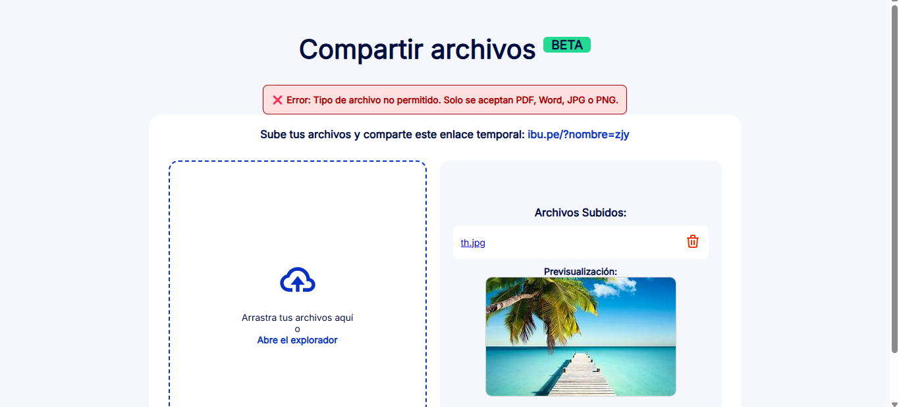

# Instafile – Compartir Archivos 🧾📤

Aplicación web en PHP para subir, gestionar y previsualizar archivos PDF, Word e imágenes (JPG/PNG) desde el navegador.

## ✅ Funciones principales

- Subida de archivos permitidos (PDF, DOC, DOCX, JPG, PNG)
- Previsualización integrada para PDF e imágenes
- Eliminación de archivos
- Enlace temporal personalizado
- Límite de tamaño de archivo
- Mensajes de éxito y error

## 📸 Vista del sistema



## 🚀 Cómo usar

1. Clona este repositorio:
   ```bash
   git clone https://github.com/dayannecueva/instafile.git
